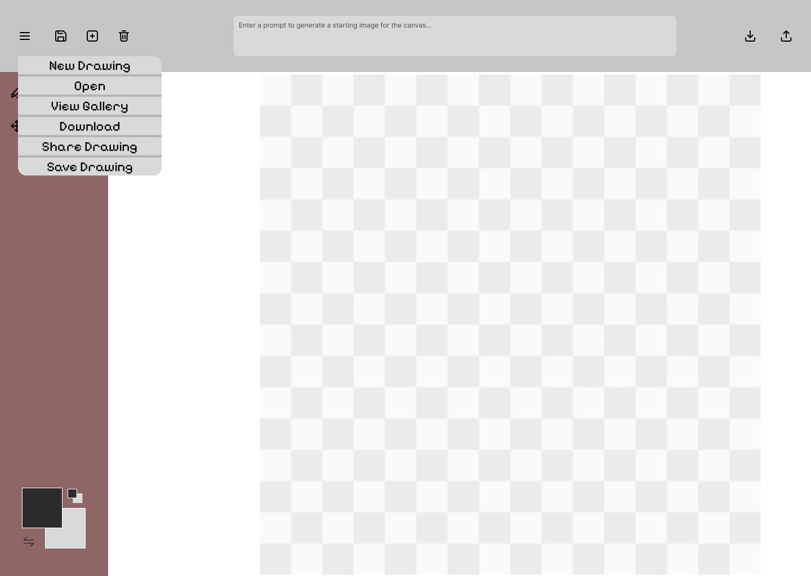
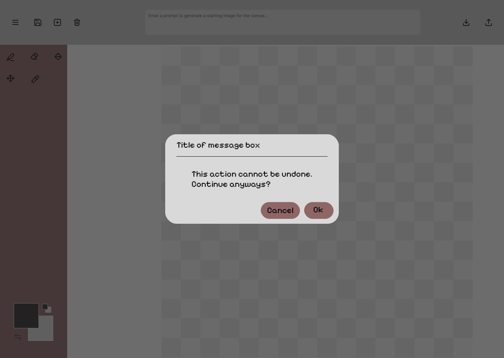
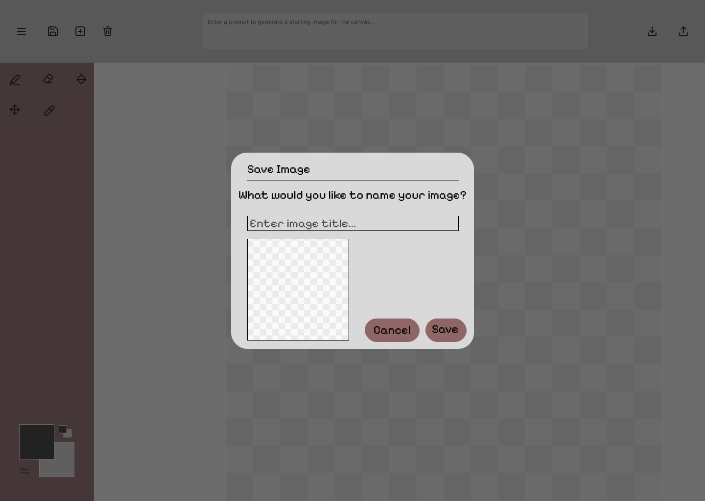
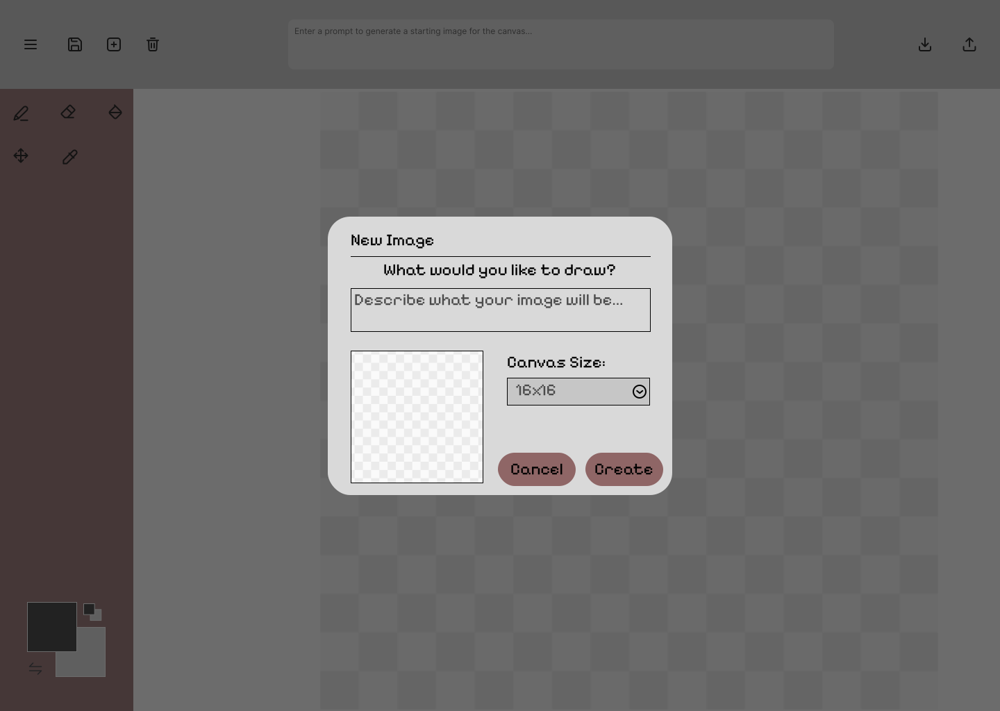
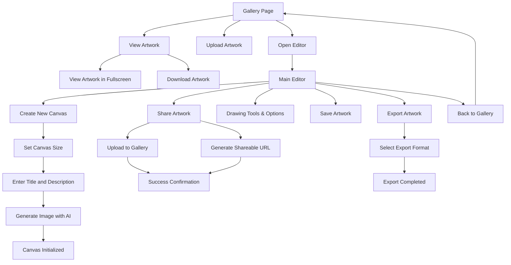

# Pixel Intelligence
A Pixel Art Editor with generative AI functionality, image downscale processing, image export, and a showcase gallery. Comp229 Group Project (Fall 2024).

 **Group Members:**
 - Connor *"[ConnorBP](https://github.com/ConnorBP)"* Postma (301005412)
 - Yoon "[superYM222](https://github.com/superYM222)" Min (301317593)
 - Sanjeevkumar "[sanjeev-cs](https://github.com/sanjeev-cs)" Chauhan (301480021)
 - Parmila "[Parmilashams](https://github.com/Parmilashams)" Shams (301426195)

[TOC]

# Design / Wireframes
*Original Figma mockups may be viewed here:*

- Main Editor UI: https://www.figma.com/design/MgBOfcN73AzYPKFxObLKvs/Pixel-Editor-Concept?node-id=0-1&t=L3mJyJCMEhV7dZpK-1
- New Image: https://www.figma.com/design/MgBOfcN73AzYPKFxObLKvs/Pixel-Editor-Concept?node-id=30-170&t=8Nb4CZyowUKdhHfR-1
- Save Image: https://www.figma.com/design/MgBOfcN73AzYPKFxObLKvs/Pixel-Editor-Concept?node-id=30-142&t=8Nb4CZyowUKdhHfR-1
- Confirmation box: https://www.figma.com/design/MgBOfcN73AzYPKFxObLKvs/Pixel-Editor-Concept?node-id=25-132&t=8Nb4CZyowUKdhHfR-1
- Context Menu: https://www.figma.com/design/MgBOfcN73AzYPKFxObLKvs/Pixel-Editor-Concept?node-id=25-54&t=8Nb4CZyowUKdhHfR-1
- Gallery Page: https://www.figma.com/design/7c2ijnyfajgfeeMJjpeS9j/Comp_229_Project?node-id=0-1&t=HFC8hwDvlPgtngwJ-1
- Share Screen: https://www.figma.com/design/7c2ijnyfajgfeeMJjpeS9j/Comp_229_Project?node-id=20-30&t=HFC8hwDvlPgtngwJ-1
- Color Selector Popup: https://www.figma.com/design/7c2ijnyfajgfeeMJjpeS9j/Comp_229_Project?node-id=20-2&t=HFC8hwDvlPgtngwJ-1

_Wireframe mockup of the main pixel editor ui._

_Wireframe mockup of the pixel editor context menu._

_Confirmation box for delete or overwrite._

_Save image popup menu._

_Create new image popup overlay._

_Wireframe mockup for Gallery page._

_Wireframe mockup for Share Screen._

_Wireframe mockup for Color Selector Pop-Up._

# Functional Requirements

## Required Features
The application must:
- have a maximum canvas size of 64px by 64px
- have a minimum canvas size of 8px by 8px
- allow users to select a resolution for their pixel art image on start
- load with a sensible default canvas size initially
- allow a prompt to generate an image on canvas creation
- store all editor state (especially pixels) on page reload using local storage
- allow the user to download a png copy of the image
- have drawing tools including: pencil, eraser, clear, eyedropper, and fill-bucket
- have a color selection tool with primary color, secondary color, and a swap button
- have a database for storing gallery entries
- have some sort of storage for storing gallery uploads (maybe s3 bucket)
- allow users to share their creations

## Stretch Goals
- Crochet pattern export
- encoded URL share codes for pixel art (could use RLE encoding format by ConnorBP)
- extended color palette presets
- additional file export formats (popular sprite editor formats, JSON, WebP, etc)
- login page (user login system)

# User Stories and Use Cases 
### User Stories

1. **Create account.**

​		As a user, I want to create an account with email and password.

​		Property: Medium

​		**Acceptance Criteria:** 

​		When the user for the first, create an account with their email and password. 

​		Create account is successful and an message show the create account succesfully.

2. **Login with account.** 

​		As a user, I want to login with my account to start.

​		Property: High

​		**Acceptance Criteria:** 

​		The user enter their email and password in the input box.

​		Login is successful user can start canvas.

​		Login fails, and an error message is displayed to the user for an incorrect email or password.

3. **Select a Pixel.** 

​		As a user, I want to select pixel art canvas at the beginning, so that I can create images.

​		Property: High

​		**Acceptance Criteria:** 

​		When the user opens the editor,  a message appears asking for user to choose the canvas size.

​		The options should range between 8x8 to 64x64 pixels.

​		A default size is 16x16 for first-time user.

​		The canvas should be initialized to the pixel chosen by user, and users can start it.

4. **Save canvas state and creations**

​		As a user, I want to save my creations to library and canvas state to local storage.

​		Property: High

​		**Acceptance Criteria:** 

​		The canvas state should save on local storage. 

​		When user reload the page without losing their canvas state.

​		User can save their creations on library(sever). 

5. **Download a png copy of the image.**

​		As a user, I want to download my creations as a png image file.

​		Property: Medium

​		**Acceptance Criteria:** 

​		The user should have a “Download” button. When clicked, the PNG file should download the current canvas state. 

6. **Provide drawing tools.**

​		As a user, I want drawing tools(e.g., pencil, eraser, and fill-bucket) to create and edit details of my pixel art.

​		Property: Medium

​		**Acceptance Criteria:** 

​		The editor include the tools in the toolbar:

​		Pencil Tool: Draws on pixels using the selected colors.

​		Eraser Tool: Clear pixels.

​		Fill-Bucket Tool: Fills areas which clicked from user to select a color.

​		Clear Tool: Reset the entire canvas to empty state.

### Use Cases
1. **Use Case: Creating a New Pixel Art Canvas**
   
    #### Actors:
	User: Initiates the canvas creation process.
    System: Provides options for canvas size and initializes the canvas.
    #### Description:
    1.	The user selects the option to create a new canvas.
    2.	The system prompts the user to choose the canvas size (8x8 to 64x64 pixels).
    3.	The user selects the desired resolution, and the system creates the canvas with the selected size.
    #### Preconditions:
    - The user is on the editor screen.
    -The user has not yet created a canvas.
    #### Postconditions:
    - The new canvas is created with the specified size.
    - The user can begin drawing on the canvas.
2. **Use Case: Drawing on the Canvas**
   
    #### Actors:
    - User: Selects drawing tools and interacts with the canvas.
    - System: Updates the canvas pixels and maintains the drawing state.
    #### Description:
    1.	The user selects a drawing tool (pencil, eraser, or fill-bucket) and draws on the canvas.
    2.	The system applies the selected tool to the canvas at the user's cursor position.
    #### Preconditions:
    - The user has a canvas created.
    - The user selects a drawing tool.
    #### Postconditions:
    - The pixels on the canvas are updated according to the tool and color selected.
    - The editor state is saved in local storage.
3. **Use Case: Using the Color Selection Tool**
   
    #### Actors:
    - User: Chooses primary and secondary colors and interacts with the swap button.
    - System: Updates the selected colors and applies them to the tools.
    #### Description:
    1.	The user selects a primary color and a secondary color.
    2.	The user clicks the "Swap" button to interchange the colors.
    #### Preconditions:
    - The user is on the editor screen.
    - The user has selected primary and secondary colors.
    #### Postconditions:
    - The selected colors are updated.
    - The colors are swapped and applied to the drawing tools.
4. **Use Case: Saving Pixel Art as PNG**
   
    #### Actors:
    - User: Initiates the save process.
    - System: Converts the artwork into a PNG file and provides it for download.
    #### Description:
    1.	The user clicks the "Save" button.
    2.	The system generates a PNG version of the pixel art and prompts the user to download the file.
    #### Preconditions:
    - The user has created or edited a canvas.
    - The user has made changes to the canvas.
    #### Postconditions:
    - The pixel art is saved as a PNG file and downloaded to the user's device.
5. **Use Case: Exporting Pixel Art in Multiple Formats**
   
    #### Actors:
    - User: Chooses the export format.
    - System: Prepares and downloads the artwork in the selected format.
    #### Description:
    1.	The user clicks the "Export" button.
    2.	The system displays a list of available formats (e.g., PNG, JSON, WebP, sprite formats).
    3.	The user selects a format and clicks "Export."
    4.	The system generates and downloads the file in the selected format.
    #### Preconditions:
    - The user has created a pixel art image.
    #### Postconditions:
    - The artwork is exported and downloaded in the selected format.
6. **Use Case: Gallery Upload**
   
    #### Actors:
    - User: Provides the artwork for upload.
    - System: Uploads the artwork to the server and confirms success.
    #### Description:
    1.	The user selects the option to upload their artwork to the gallery.
    2.	The user enters a title and description.
    3.	The system uploads the artwork to the server.
    #### Preconditions:
    - The user is logged in and has a pixel art image.
    #### Postconditions:
    - The artwork is uploaded to the gallery and confirmation is provided.
7. **Use Case: Browsing the Gallery**
   
    #### Actors:
    - User: Navigates the gallery and views artwork.
    - System: Retrieves and displays gallery content.
    #### Description:
    1.	The user navigates to the gallery page.
    2.	The system loads a list of shared artwork from the server.
    3.	The user scrolls through the gallery and clicks on artwork to view it.
    #### Preconditions:
    - The user is on the gallery page.
    - The system has artwork in the gallery.
    #### Postconditions:
    - The user browses and views gallery content.
8. **Use Case: Viewing and Downloading Shared Artwork**
   
    #### Actors:
    - User: Selects artwork for viewing or downloading.
    - System: Displays the artwork and allows downloads.
    #### Description:
    1.	The user clicks on artwork in the gallery.
    2.	The system displays the artwork in full view with a download option.
    3.	The user clicks "Download" to save the artwork.
    #### Preconditions:
    - The artwork is available in the gallery.
    #### Postconditions:
    - The artwork is displayed and downloadable.
    
9. **Use Case: Creating a New Pixel Art Canvas**
   
    #### Actors:
	User: Initiates the canvas creation process.
    System: Provides options for canvas size and initializes the canvas.
    #### Description:
    1.	The user selects the option to create a new canvas.
    2.	The system prompts the user to choose the canvas size (8x8 to 64x64 pixels).
    3.	The user selects the desired resolution, and the system creates the canvas with the selected size.
    #### Preconditions:
    - The user is on the editor screen.
    -The user has not yet created a canvas.
    #### Postconditions:
    - The new canvas is created with the specified size.
    - The user can begin drawing on the canvas.
10. **Use Case: Drawing on the Canvas**
    
    #### Actors:
    - User: Selects drawing tools and interacts with the canvas.
    - System: Updates the canvas pixels and maintains the drawing state.
    #### Description:
    1.	The user selects a drawing tool (pencil, eraser, or fill-bucket) and draws on the canvas.
    2.	The system applies the selected tool to the canvas at the user's cursor position.
    #### Preconditions:
    - The user has a canvas created.
    - The user selects a drawing tool.
    #### Postconditions:
    - The pixels on the canvas are updated according to the tool and color selected.
    - The editor state is saved in local storage.
11. **Use Case: Using the Color Selection Tool**
    
    #### Actors:
    - User: Chooses primary and secondary colors and interacts with the swap button.
    - System: Updates the selected colors and applies them to the tools.
    #### Description:
    1.	The user selects a primary color and a secondary color.
    2.	The user clicks the "Swap" button to interchange the colors.
    #### Preconditions:
    - The user is on the editor screen.
    - The user has selected primary and secondary colors.
    #### Postconditions:
    - The selected colors are updated.
    - The colors are swapped and applied to the drawing tools.
12. **Use Case: Saving Pixel Art as PNG**
    
    #### Actors:
    - User: Initiates the save process.
    - System: Converts the artwork into a PNG file and provides it for download.
    #### Description:
    1.	The user clicks the "Save" button.
    2.	The system generates a PNG version of the pixel art and prompts the user to download the file.
    #### Preconditions:
    - The user has created or edited a canvas.
    - The user has made changes to the canvas.
    #### Postconditions:
    - The pixel art is saved as a PNG file and downloaded to the user's device.
13. **Use Case: Exporting Pixel Art in Multiple Formats**
    
    #### Actors:
    - User: Chooses the export format.
    - System: Prepares and downloads the artwork in the selected format.
    #### Description:
    1.	The user clicks the "Export" button.
    2.	The system displays a list of available formats (e.g., PNG, JSON, WebP, sprite formats).
    3.	The user selects a format and clicks "Export."
    4.	The system generates and downloads the file in the selected format.
    #### Preconditions:
    - The user has created a pixel art image.
    #### Postconditions:
    - The artwork is exported and downloaded in the selected format.
14. **Use Case: Gallery Upload**
    
    #### Actors:
    - User: Provides the artwork for upload.
    - System: Uploads the artwork to the server and confirms success.
    #### Description:
    1.	The user selects the option to upload their artwork to the gallery.
    2.	The user enters a title and description.
    3.	The system uploads the artwork to the server.
    #### Preconditions:
    - The user is logged in and has a pixel art image.
    #### Postconditions:
    - The artwork is uploaded to the gallery and confirmation is provided.
15. **Use Case: Browsing the Gallery**
    
    #### Actors:
    - User: Navigates the gallery and views artwork.
    - System: Retrieves and displays gallery content.
    #### Description:
    1.	The user navigates to the gallery page.
    2.	The system loads a list of shared artwork from the server.
    3.	The user scrolls through the gallery and clicks on artwork to view it.
    #### Preconditions:
    - The user is on the gallery page.
    - The system has artwork in the gallery.
    #### Postconditions:
    - The user browses and views gallery content.
16. **Use Case: Viewing and Downloading Shared Artwork**
    
    #### Actors:
    - User: Selects artwork for viewing or downloading.
    - System: Displays the artwork and allows downloads.
    #### Description:
    1.	The user clicks on artwork in the gallery.
    2.	The system displays the artwork in full view with a download option.
    3.	The user clicks "Download" to save the artwork.
    #### Preconditions:
    - The artwork is available in the gallery.
    #### Postconditions:
    - The artwork is displayed and downloadable.

# User Interface Flow

