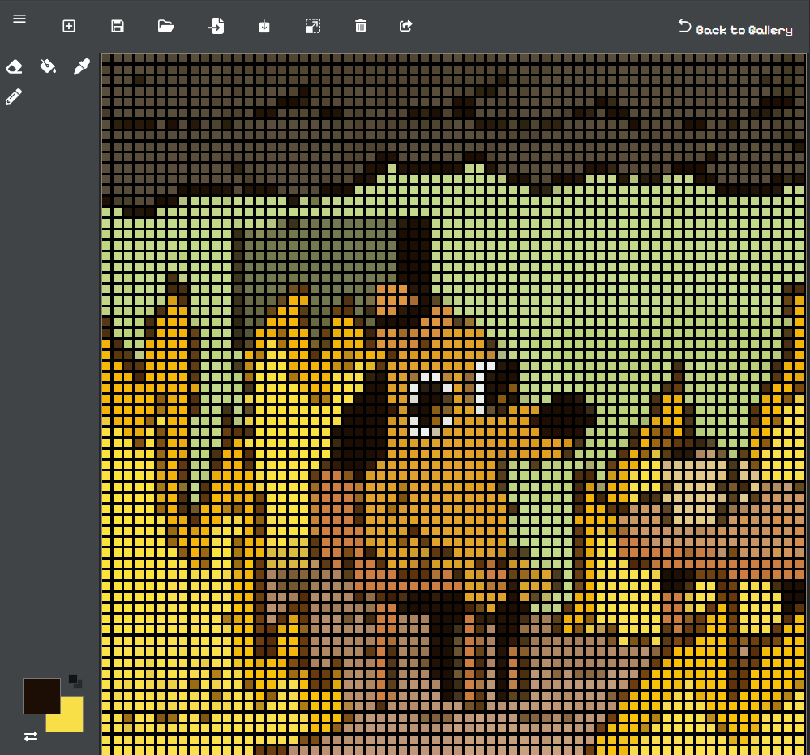
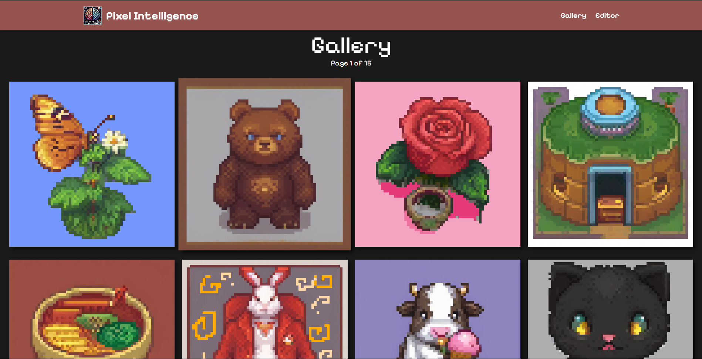
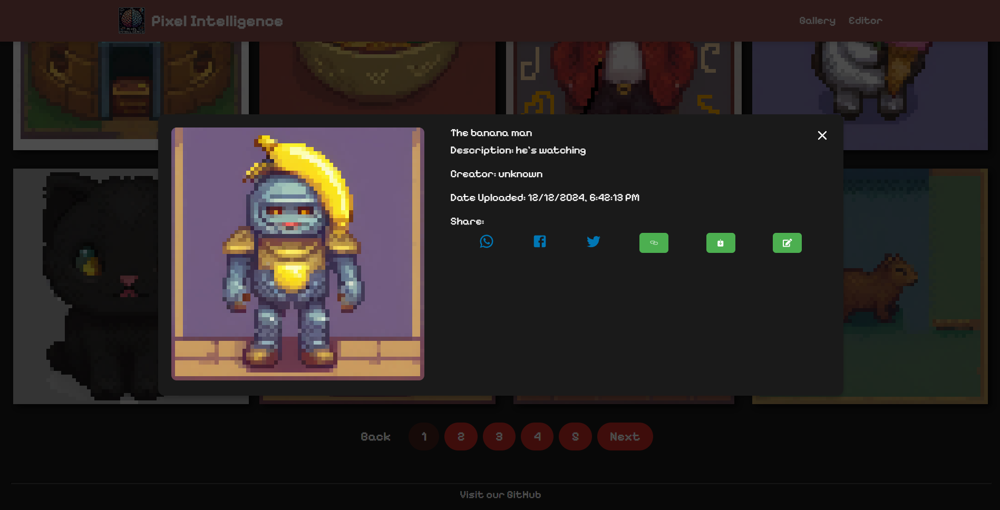

# Pixel Intelligence [](https://app.netlify.com/sites/229-pixelai/deploys)


> Latest live demo can be viewed on [Netlify](https://229-pixelai.netlify.app)

## Overview

Pixel Intelligence is a full-stack pixel art editor application with [generative AI functionality through stablehorde](https://stablehorde.net/), image downscale processing, image export, and a showcase gallery. This project was developed as part of the Comp229 Group Project (Fall 2024).





## Features

### Editor
- Maximum canvas size of 64px by 64px
- Minimum canvas size of 8px by 8px
- Resolution selection and adjustment while editing
- Drawing tools: pencil, eraser, clear, eyedropper, and fill-bucket
- Color selection with primary/secondary colors
- Project save/load functionality
- PNG image export
- Image import with k-means clustering down-scaling
- Transparency support
- Share directly to gallery

### Gallery
- Paginated image display
- Image metadata and details view
- Project file storage
- Dynamic image rendering from stored data
- Client-side caching
- Sort by newest first

### AI Integration
- Image generation via Horde AI API
- Optimized for pixel art style output
- Generation prompt on canvas creation

## Current Implementation Status

### Completed
- Full-featured pixel art editor
- Gallery system with pagination
- Project file save/load
- Image import/export
- Dynamic image rendering
- Client-side caching

### In Progress
- AI image generation frontend integration
- Clone to editor from gallery
- Additional file format support

### Stretch Goals Status
- ✅ Extended metadata support
- ✅ Image scaling in editor
- ❌ Crochet pattern export
- ❌ URL share codes
- ❌ Extended color palettes  
- ❌ Additional file formats
- ❌ User login system
- ❌ Undo-redo support

## Why We Made It

The goal of this project is to provide a comprehensive tool for creating and sharing pixel art. By integrating generative AI, we aim to enhance the creative process and offer unique features that set this editor apart from others.

## Getting Started

### Prerequisites

- Node.js (v14 or higher)
- npm (v6 or higher)

### Installation

1. Clone the repository:
    ```sh
    git clone https://github.com/ConnorBP/pixel-intelligence.git
    cd pixel-intelligence
    ```

2. Install dependencies for the main project:
    ```sh
    npm install
    ```

3. Install dependencies for the frontend:
    ```sh
    cd frontend
    npm install
    cd ..
    ```

4. Install dependencies for the backend:
    ```sh
    cd backend
    npm install
    cd ..
    ```

5. Set up the environment variables
    [Variables can be found example.env](./backend/example.env)
    ```sh
    cp ./backend/example.env ./backend/.env
    vim .env
    ```

### Running the Project

To start the development server, run:
```sh
npm run dev
```

This will concurrently start both the frontend and backend servers.

### Building the Project

To build the project for production, run:
```sh
npm run build
```

This will build the frontend and prepare the backend for deployment.

## Contributing

We welcome contributions! Please read our [contributing guidelines](CONTRIBUTING.md) for more details.

## License

This project is licensed under the MIT License. See the [LICENSE](LICENSE) file for details.

## Authors

- ConnorBP
- sanjeev-cs
- superYM222
- Parmilashams

## Acknowledgements

Special thanks to our instructors and peers for their support and feedback throughout this project.
