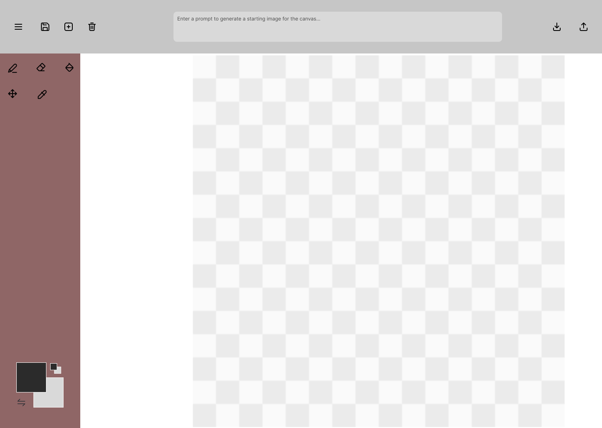

# pixel-intelligence
 Pixel art editor with generative AI functionality. Comp229 Group Project.

 **Group Members:**
 - Connor *"ConnorBP"* Postma
 - Yoon "superYM222" Min
 - Sanjeevkumar "sanjeev-cs" Chauhan
 - Parmila "Parmilashams" Shams

# Design / Wireframes
mockup can be viewed here: https://www.figma.com/design/MgBOfcN73AzYPKFxObLKvs/Pixel-Editor-Concept?node-id=0-1&t=L3mJyJCMEhV7dZpK-1

designs todo:

- [ ] create new image prompt screen (overlay)
- [ ] share options prompt screen (overlay)
- [ ] save options screen (overlay)
- [ ] top-left context menu actions
- [ ] color selector popup
- [ ] deletion confirmation popup
- [ ] gallery page
- [ ] (Maybe) landing page
- [ ] (Maybe) color pallets menu

*first wireframe mockup of the pixel editor concept*

# Functional Requirements

## Required Features
The application must:
- have a maximum canvas size of 64px by 64px
- have a minimum canvas size of 8px by 8px
- allow users to select a resolution for their pixel art image on start
- load with a sensible default canvas size initially
- allow a prompt to generate an image on canvas creation
- store all editor state (especially pixels) on page reload using local storage
- allow the user to download a png copy of the image
- have drawing tools including: pencil, eraser, clear, eyedropper, and fill-bucket
- have a color selection tool with primary color, secondary color, and a swap button

## Strech Goals
- Crochet pattern export
- encoded url share codes for pixel art (could use RLE encoding format by ConnorBP)
- gallery with shared creations stored on server (maybe s3 bucket)
- extended color palete presets
- additional file export formats (popular sprite editor formats, json, webp, etc)
- login page (user login system)

## User Stories and Use Cases 
### User Stories
- TODO
### Use Cases
Use Cases
1. Use Case: Creating a New Pixel Art Canvas
Actors:
•	User: Initiates the canvas creation process.
•	System: Provides options for canvas size and initializes the canvas.
Description:
1.	The user selects the option to create a new canvas.
2.	The system prompts the user to choose the canvas size (8x8 to 64x64 pixels).
3.	The user selects the desired resolution, and the system creates the canvas with the selected size.
Preconditions:
•	The user is on the editor screen.
•	The user has not yet created a canvas.
Postconditions:
•	The new canvas is created with the specified size.
•	The user can begin drawing on the canvas.
2. Use Case: Drawing on the Canvas
Actors:
•	User: Selects drawing tools and interacts with the canvas.
•	System: Updates the canvas pixels and maintains the drawing state.
Description:
1.	The user selects a drawing tool (pencil, eraser, or fill-bucket) and draws on the canvas.
2.	The system applies the selected tool to the canvas at the user's cursor position.
Preconditions:
•	The user has a canvas created.
•	The user selects a drawing tool.
Postconditions:
•	The pixels on the canvas are updated according to the tool and color selected.
•	The editor state is saved in local storage.
3. Use Case: Using the Color Selection Tool
Actors:
•	User: Chooses primary and secondary colors and interacts with the swap button.
•	System: Updates the selected colors and applies them to the tools.
Description:
1.	The user selects a primary color and a secondary color.
2.	The user clicks the "Swap" button to interchange the colors.
Preconditions:
•	The user is on the editor screen.
•	The user has selected primary and secondary colors.
Postconditions:
•	The selected colors are updated.
•	The colors are swapped and applied to the drawing tools.
4. Use Case: Saving Pixel Art as PNG
Actors:
•	User: Initiates the save process.
•	System: Converts the artwork into a PNG file and provides it for download.
Description:
1.	The user clicks the "Save" button.
2.	The system generates a PNG version of the pixel art and prompts the user to download the file.
Preconditions:
•	The user has created or edited a canvas.
•	The user has made changes to the canvas.
Postconditions:
•	The pixel art is saved as a PNG file and downloaded to the user's device.
5. Use Case: Exporting Pixel Art in Multiple Formats
Actors:
•	User: Chooses the export format.
•	System: Prepares and downloads the artwork in the selected format.
Description:
1.	The user clicks the "Export" button.
2.	The system displays a list of available formats (e.g., PNG, JSON, WebP, sprite formats).
3.	The user selects a format and clicks "Export."
4.	The system generates and downloads the file in the selected format.
Preconditions:
•	The user has created a pixel art image.
Postconditions:
•	The artwork is exported and downloaded in the selected format.
6. Use Case: Gallery Upload
Actors:
•	User: Provides the artwork for upload.
•	System: Uploads the artwork to the server and confirms success.
Description:
1.	The user selects the option to upload their artwork to the gallery.
2.	The user enters a title and description.
3.	The system uploads the artwork to the server.
Preconditions:
•	The user is logged in and has a pixel art image.
Postconditions:
•	The artwork is uploaded to the gallery and confirmation is provided.
7. Use Case: Browsing the Gallery
Actors:
•	User: Navigates the gallery and views artwork.
•	System: Retrieves and displays gallery content.
Description:
1.	The user navigates to the gallery page.
2.	The system loads a list of shared artwork from the server.
3.	The user scrolls through the gallery and clicks on artwork to view it.
Preconditions:
•	The user is on the gallery page.
•	The system has artwork in the gallery.
Postconditions:
•	The user browses and views gallery content.
8. Use Case: Viewing and Downloading Shared Artwork
Actors:
•	User: Selects artwork for viewing or downloading.
•	System: Displays the artwork and allows downloads.
Description:
1.	The user clicks on artwork in the gallery.
2.	The system displays the artwork in full view with a download option.
3.	The user clicks "Download" to save the artwork.
Preconditions:
•	The artwork is available in the gallery.
Postconditions:
•	The artwork is displayed and downloadable.

